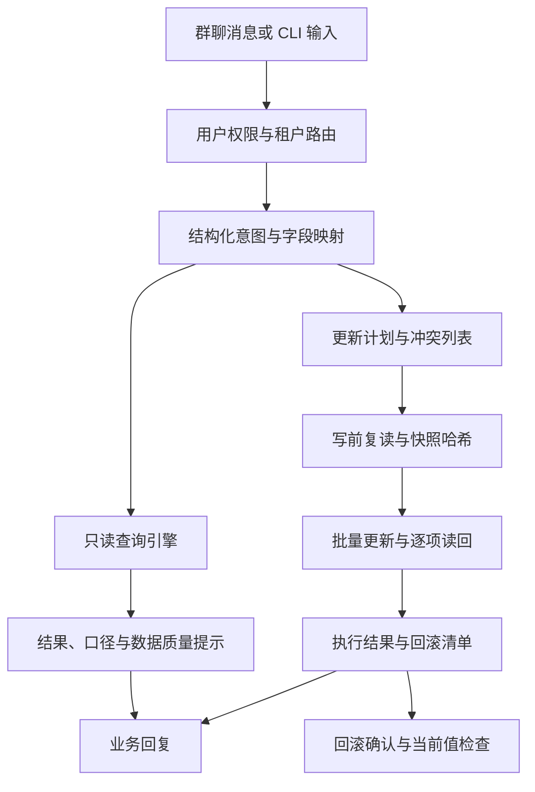

# 飞书经营数据助手

**让经营问题可以在群里问清楚，让表格更新可以追到计划、备份和实际结果。**

运营数据经常分散在合作记录、上线表、店铺报表和本地导出文件里。“这个产品最近表现怎样”看起来是一句话，背后却要确定商品别名、店铺、日期口径、指标字段，以及重复行究竟应该怎样处理。需要同步数据时，还要考虑更新错记录、消息重复送达和别人同时改表。

这个项目把飞书群聊作为业务入口，把读取、计算和写入做成独立的处理链。模型将自然语言转换为结构化意图；TypeScript 执行筛选、聚合与排序；飞书适配层读取实际记录。需要修改表格时，再进入带计划、备份、读回与回滚的任务流程。

仓库还包含 XLSX / CSV 导入、多店铺路由、定时报告、经营数据质量检查，以及工作台插件。它们共用配置和业务规则，正式企业配置与业务数据保留在各自环境。

## 从三个日常问题理解这个项目

下面是使用场景示意，不是已连接企业应用的聊天截图或真实经营结果。

### 查询：先确定口径，再给数字

```text
某产品上周上线了多少条视频？
最近七天哪些商品的播放量最高？
把指定店铺的上线明细按日期列出来。
```

助手要把商品、店铺、日期、指标和输出形式解析成查询意图，再交给代码执行。回答除了结果，还能带匹配记录数、使用字段、日期范围与数据质量提示。没有匹配记录和指标无法计算时，需要明确说明原因。

### 导入：先看计划，再决定是否写入

一个 XLSX 文件里的数字列，可能在飞书里被建成文本；日期、空值和字段类型也可能不一致。导入入口先读取文件与工作表，产生字段映射、计划记录数和可能失败的字段。预演阶段不调用飞书写接口。

### 同步：不靠视频标题猜记录

更新视频播放量时，先从 TikTok 管线取得规范化的机器结果，再按视频 ID 匹配目标记录。一个视频匹配到多行、同一份输入出现冲突 ID、目标字段类型不允许写入，都进入冲突记录；当前视频更新流程不会在找不到匹配时盲目新增。

## 能力与模块

| 能力 | 具体处理 | 主要模块 |
| --- | --- | --- |
| 数据问答 | 明细、计数、去重对象、求和、平均、排名与概览 | `src/query/`、`src/bot/` |
| 文件接入 | 本地 XLSX / CSV 读取、结构检查、导入计划与预演 | `src/importer/` |
| 企业表格 | 多维表格读取与 API 适配 | `src/feishu/` |
| 店铺隔离 | 租户配置、群聊路由、业务字段与凭证引用 | `src/config/` |
| 实时更新 | 持久任务、写前快照、执行、读回与回滚 | `src/realtime/` |
| 定时工作 | 每日报告、初始化恢复、串行任务与监控 | `src/automation/`、机器人相关模块 |
| 业务检查 | 店铺风险、数据质量、归因与 ROI 相关检查 | `src/shop-risk/`、`src/cli/` |
| 工作台 | 面向经营视图的插件与适配代码 | `apps/` |

不同入口需要不同的授权、表结构和配置。源码中有一个模块，不代表使用者已经接通对应的外部应用。

## 查询与更新的架构



查询接口与写入流程共用业务配置，但不共用“看到一句话就直接改表”的执行方式。写入任务需要保留操作对象、字段变化和冲突信息，后续才能核对或恢复。

## 查询引擎：模型解释问题，代码执行计算

### 一个回答应当可以追到哪些内容

`QueryResult` 除了 `value`，还保留匹配行数、各来源表的匹配数量、无效数字行数、检测到的重复行、指标字段、日期范围和展示行数。

这几个字段解决的是不同问题：匹配行数说明计算范围，展示行数说明回复是不是截断的明细，来源表数量帮助看出是否跨表，无效数字提示说明统计中有多少值无法使用。

### 不把无法计算默认为零

查询先做对象与日期筛选，再处理数值条件。缺少日期字段时不会伪造日期筛选；需要聚合但没有匹配记录时，不生成一个“0”来掩盖没有数据。指标字段不存在或没有可计算数字，也会报告明确错误。

排名与平均值使用解析后的有效数值，额外统计无效内容。这样读者能区分真实零值、缺失字段和转换失败。

### 发现重复，不擅自删除业务记录

两条完全相同的表格行，有可能是重复导入，也有可能是两次真实合作。引擎按规范化行检测重复数量，但不会自动把所有相同行删掉。需要去重对象数量时，使用独立的 `distinct_count` 口径。

明细查询还能排序、选择字段与限制展示行数。导出结果超过 10,000 行时要求缩小条件，避免一次群聊请求生成无法审阅的大量记录。

## 多店铺：路由、字段和凭证一起切换

只有“店铺名称不同”不足以形成隔离。不同店铺可能使用不同表格、商品映射、时区和凭证档案，查询还可能由群聊或私聊触发。

租户注册表把这些内容放在同一份配置中：

| 配置维度 | 用途 |
| --- | --- |
| 租户与店铺别名 | 将业务名称解析到确定的店铺 |
| 群聊绑定 | 确定当前对话属于哪个范围 |
| 表格与字段映射 | 使用本租户的数据源和业务字段 |
| 商品映射 | 处理标准商品名与平台商品的对应关系 |
| 时区与日期基准 | 解释报表中的日期范围 |
| 凭证档案 | 引用本机保存的相应授权 |
| 用户与会话范围 | 判断当前发言者能查询哪些数据 |

配置装载会检查重复绑定和隔离冲突，包括共享资源与凭证引用中的问题。私聊读取范围由允许用户与业务规则决定，不能把任意私聊自动当作跨店管理员查询。

单租户兼容路径也有自己的配置条件；多租户场景应明确配置路由，避免依赖含糊的默认店铺。

## 实时更新：从计划到写后核对

以视频播放量同步为例，完整流程分为六步。

### 1. 建立明确的更新计划

机器合同中的视频 ID、播放量和冲突记录先经过检查。目标表按 ID 找候选，拒绝多候选；目标字段必须存在且类型在写入白名单内。已经等于目标值的记录无需再次修改。

每条变化保存目标表、记录 ID、原字段与计划写入字段。先把将要发生什么表达出来，才能讨论是否应该执行。

### 2. 复读目标，发现计划之后的变化

执行前重新读取当前记录，比较要写入字段与计划中的原值。被其他人改过的记录列为并发冲突，跳过对应变更。

复读过程还补齐当前字段快照，为后续备份准备实际依据。

### 3. 写前保存快照与哈希

任务目录保存 `before.json` 和 `before.sha256`，记录目标资源与原值。快照文件按受限权限写入；SHA-256 用于核对文件完整性，不能把它当成防止有权限操作者同时改写文件和哈希的签名。

### 4. 分批执行，不吞掉部分失败

写入前还有一次目标值检查，随后按表组织批次，每批最多 50 条，并使用请求标识。成功写入和失败项目分别记录。

### 5. 读回实际字段

API 返回成功之后，再读取实际记录，确认目标字段是否等于计划值。写入请求成功与写后核对成功分别统计，避免把不确定结果直接归为完成。

### 6. 生成回滚清单

回滚清单保存预期写后值和需要恢复的原字段。它不是整张表的旧备份覆盖；回滚只针对本任务的变化，并且还需要当前值检查。

远程多维表格不提供这套流程所需的跨请求事务或原子比较更新。两次读取之间仍可能发生并发修改，复读与备份是在缩小不确定范围，不能宣称完全消除了竞争条件。

## 回滚：保护任务完成后的人工修改

假设任务把某字段从 A 改成 B，后来同事又把它改成 C。此时直接恢复到 A，会覆盖同事的工作。

回滚流程先检查任务标识、快照完整性与操作清单，再读取当前字段。只有当前值仍符合本任务预期写后值的记录，才进入可恢复集合；有冲突的记录跳过，并保存原因。涉及新增记录的恢复合同也需要核对当前状态，不能直接无条件删除。

回滚有预览与显式确认。默认写入数量门槛为 100 条，超过门槛需要额外授权流程；恢复后还会读回核对实际结果。个别租户的字段批量接口兼容问题也有较慢的单记录恢复路径。

这一设计更适合处理“本轮同步哪里需要恢复”，而不是承诺远程表格具备本地数据库式的一键事务回滚。

## 任务幂等与后台工作

群聊消息可能重复送达，用户也可能在等待时再次发同一句指令。任务存储按消息标识与规范化指令的组合生成幂等键，避免把同一次送达简单执行两遍；任务结果与备份目录保留关联。

编排层管理预览、确认、恢复和排队。定时报告及初始化相关工作另有串行队列、启动保护和恢复入口。不同业务任务仍需要按照自己的状态判断能否继续，不能把“目录存在”当作已执行完成。

## 与 TikTok 数据管线的关系

这里不在群聊处理器中直接实现平台签名、分页和原始快照管理。那些工作放在 [TikTok Shop 数据管线](https://github.com/h296025733-sys/tiktok-shop-data-pipeline) 中，助手消费它的机器 JSON。

`TIKTOK_PIPELINE_ROOT` 指定管线位置，必要时用 `TIKTOK_PIPELINE_PYTHON` 指定解释器。合同中的失败、缺失和冲突需要一路保留，不能因为展示端希望有一个数字就补成零。

视频播放量、订单归因、广告费用和 ROI 使用不同的数据与口径，相关业务模块分别检查。公开示例用于表达结构，不代表已有真实店铺经营数据。

## 本地开始：先检查文件，再连接企业应用

建议 Node.js 24+，依赖使用 pnpm。

```powershell
pnpm install --frozen-lockfile
Copy-Item .env.example .env
pnpm typecheck
pnpm test
```

### 本地文件入口

`LocalFileDataSource` 支持 CSV / XLSX / XLS。CLI 默认从 `input/` 读取唯一候选文件，多个候选时会要求明确输入，读取第一个工作表并检测表头；自己的调用代码也可以直接传入文件路径。先检查结构与导入预演：

```powershell
pnpm inspect-input
pnpm import:dry
pnpm ask "某产品的利润合计是多少"
```

商品与字段需替换成文件实际内容。`MODEL_PROVIDER=mock` 只用于本地模型适配开发，不是通用自然语言模型，也不代表上述任意问题都能被正确解析。

### 企业应用配置

| 配置 | 说明 |
| --- | --- |
| `.env.example` → `.env` | 自己的应用授权、允许用户、模型与运行开关 |
| `config/business-profile.example.json` → `config/business-profile.json` | 表名、业务时区、商品映射和自动化设置 |
| `config/tenant-registry.example.json` | 每家店铺与群聊路由的示例结构 |
| `TIKTOK_PIPELINE_ROOT` | 只读平台数据管线的位置 |
| `MODEL_PROVIDER` | 本地 mock 或自行配置的模型提供方 |
| `DRY_RUN` | 导入等入口的预演设置，示例默认为开启 |

示例业务配置启用模板模式并关闭定时任务。先完成用户范围、字段映射和只读检查，再进入写入路径。具体步骤见 [本地配置说明](docs/local-configuration.md)。

`pnpm bot` 是机器人启动入口；实际消息、定时报告和表格写入会依赖自己的飞书应用权限。仓库中的历史迁移 CLI 含 `demo_` 标识，不能直接当成已经适配本企业的迁移方案。

## 代码阅读地图

| 主题 | 实现与测试 |
| --- | --- |
| 查询口径、无效值和重复行 | [query/engine.ts](src/query/engine.ts)、[query.test.ts](tests/query.test.ts) |
| 自然语言业务入口 | [bot/service.ts](src/bot/service.ts) |
| 租户配置与冲突校验 | [tenant-registry.ts](src/config/tenant-registry.ts)、[tenant-registry.test.ts](tests/tenant-registry.test.ts) |
| 更新、备份、读回和回滚 | [feishu-video-sync.ts](src/realtime/feishu-video-sync.ts)、[realtime-update.test.ts](tests/realtime-update.test.ts) |
| 任务幂等与编排 | [job-store.ts](src/realtime/job-store.ts)、[orchestrator.ts](src/realtime/orchestrator.ts) |
| 导入与预演 | [importer/plan.ts](src/importer/plan.ts)、[importer/local-file.ts](src/importer/local-file.ts) |
| 自动化与插件 | [automation/](src/automation/)、[apps/](apps/) |

## 验证范围与公开版边界

2026-10-07 的源码检查执行了 TypeScript 检查和 Vitest：89 个文件、490 个用例通过。用例使用替代模型、网关和临时文件，覆盖查询、配置、导入及部分同步和恢复逻辑。

没有执行真实飞书群消息、正式表格写入、TikTok API、真实模型、云插件部署或企业迁移的端到端验收。完整范围见 [检查记录](docs/verification.md)。

企业表格链接、联系人、店铺标识、运行备份和正式凭证没有放入公开仓库。公开版保留业务结构与实现，需要接入者为自己的表格和应用重新配置。当前仍是可继续开发的经营工具工程，真实接入质量、并发写入时机和平台接口变化需要在目标环境验证。
