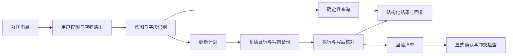

# 飞书经营数据助手

**在群聊里查询经营数据，把表格更新做成有计划、备份和核对记录的任务。**

运营数据散在多维表格、导出文件和店铺报表里。这个项目把群聊作为入口：提问时读取数据、解释统计口径；需要同步时，先确定店铺、日期、字段和目标记录，再按代码规则执行。

模型负责把自然语言变成查询意图，并组织回答。筛选、去重、计数、求和与排名由 TypeScript 执行。这样一个数字可以追到记录和计算规则，模型更换也不需要重写业务统计。

## 查询与更新走两条路径



XLSX / CSV 导入有字段检查和预演；TikTok 同步通过独立的 [只读数据管线](https://github.com/h296025733-sys/tiktok-shop-data-pipeline) 取得机器 JSON。定时报告、数据质量提示和经营工作台插件复用这些业务数据。

## 更新表格时具体处理了什么

| 场景 | 实现中的处理 |
| --- | --- |
| 一个视频匹配到多个目标记录 | 将冲突列入计划，拒绝猜测要改哪一条。 |
| 计划生成后，目标字段被人改过 | 写前复读并比较，冲突记录跳过。 |
| 同一条消息重复送达 | 按消息与规范化指令生成任务幂等键。 |
| 接口返回成功，但结果不确定 | 读回实际记录，比对目标字段，单独记录核对失败。 |
| 回滚前又有人修改了记录 | 比较当前值与本次写入值；不符合的记录跳过，保留后续修改。 |

写前快照有 SHA-256，更新计划、执行结果和回滚清单按任务保存。远程表格接口不提供本地数据库式事务，这里用复读、备份和逐项核对缩小不确定范围，仍需处理接口故障与并发时机。

## 多店铺如何分开

群聊路由先解析到租户，再使用该租户的表格、字段映射和凭证档案。配置装载会检查重复绑定与隔离冲突；会话范围和用户权限也参与查询，避免只换一个店铺名称就继续复用上一家店的数据。

## 看实现的入口

| 模块 | 代码与用例 |
| --- | --- |
| 查询过滤、聚合与口径 | [query/engine.ts](src/query/engine.ts) · [query.test.ts](tests/query.test.ts) |
| 租户解析与隔离校验 | [tenant-registry.ts](src/config/tenant-registry.ts) · [tenant-registry.test.ts](tests/tenant-registry.test.ts) |
| 更新计划、备份、读回与回滚 | [feishu-video-sync.ts](src/realtime/feishu-video-sync.ts) · [realtime-update.test.ts](tests/realtime-update.test.ts) |
| 幂等任务与流程编排 | [job-store.ts](src/realtime/job-store.ts) · [orchestrator.ts](src/realtime/orchestrator.ts) |
| 导入预演 | [importer/plan.ts](src/importer/plan.ts) |
| 经营工作台插件 | [apps/](apps/) |

## 本地准备

建议 Node.js 24+，依赖使用 pnpm。

```powershell
pnpm install --frozen-lockfile
Copy-Item .env.example .env
pnpm typecheck
pnpm test
```

示例配置的复制方式见 [本地配置](docs/local-configuration.md)。

`MODEL_PROVIDER=mock` 可用于本地开发模型适配层；它不代表真实模型或飞书链路已验证。接真实应用时，需要填写自己的飞书授权、表格字段映射、允许用户和租户配置，再检查导入预演。

`src/query/` 是查询，`src/feishu/` 是接口适配，`src/realtime/` 是更新与回滚，`apps/` 是工作台插件。只读 TikTok 管线见 [tiktok-shop-data-pipeline](https://github.com/h296025733-sys/tiktok-shop-data-pipeline)。

公开版保留实现和测试，企业表格地址、联系人、店铺标识和正式配置改为示例。历史迁移工具中的 `demo_` 标识需要按自己的表结构配置；不要将它们当作已接入的真实企业应用。

## 本次公开整理的检查

见 [检查记录](docs/verification.md)，其中区分源码与语法检查、隔离测试和未执行的真实环境路径。
